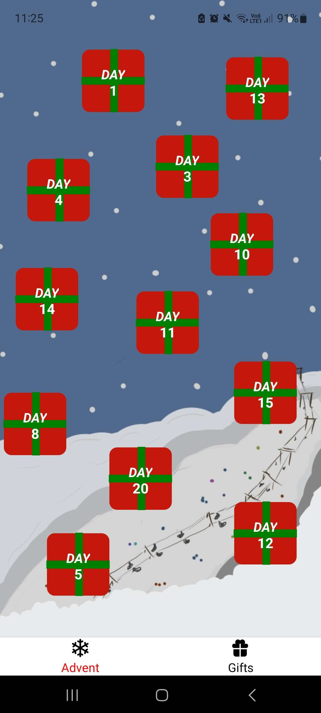
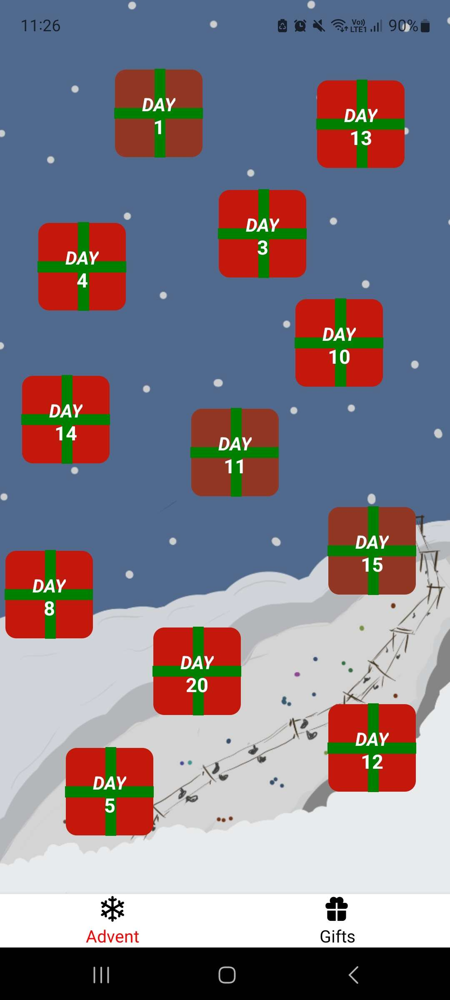

# 🎁Advent Calendar🎁 Using React Native

## 🎅🏻🎄🎅🏻🎄🎅🏻🎄🎅🏻🎄🎅🏻🎄🎅🏻🎄🎅🏻🎄🎅🏻🎄

### Home

> The home sreen welcomes the user with buttons that once pressed, will take the user to the corresponding day of the month.

    

### The dates

> Once the user presses the button, they will be taken to the corresponding day of the month were the user will be able to see the date and some special "gifts" that are hidden behind the date button.
> The "gifts" consist of a recipe idea for Christmas in a video format, a basic idea of what the recipe is and a movie idea for the day.

    
    

### Hope update

> Once the user goes back to the home screen, the button that was pressed will be updated with a different color to indicate that the user has already seen the "gift" for that day.

    

## 🎅🏻🎄🎅🏻🎄🎅🏻🎄🎅🏻🎄🎅🏻🎄🎅🏻🎄🎅🏻🎄🎅🏻🎄
### Have a jolly Christmas

>The other screen in the navigator is  the "Gifts" screen. This screen is a list of all the "gifts" that the user has seen.
> Sadly it is not yet finished, but it will be soon.
> So until then it's just a screen that says "Merry Christmas" .

 

    

